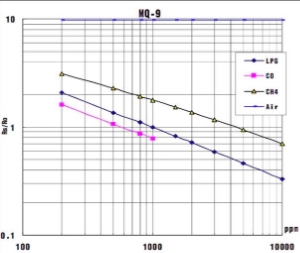
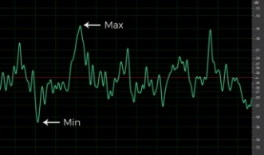
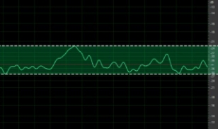
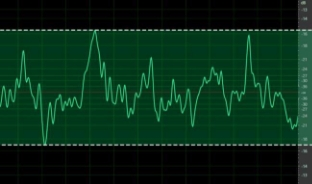
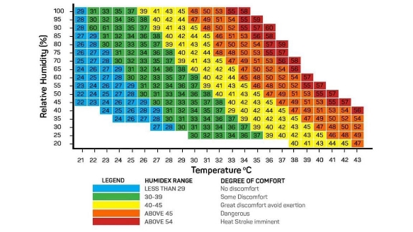
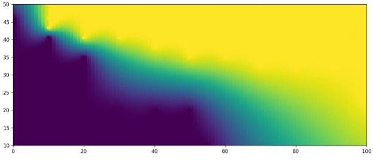
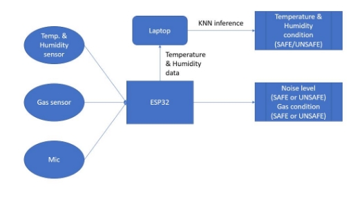
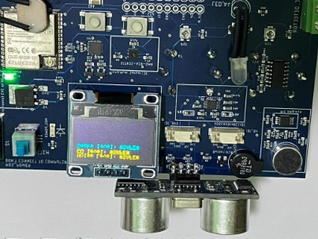
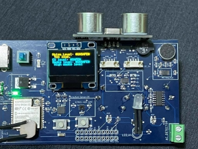
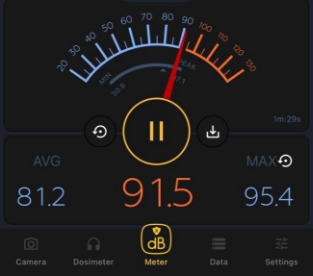

                         

                                            Project Report

                 ***Monitoring harmful emissions, noise levels and fuel*** 

                                            ***leakages in parking lots***

by 

Ruchita Bhadre Harshil Thakkar

Course: Design of Intelligent Sensor Networks (MIE1050) Course Instructor: Dr. Ardevan Bakhtari 

Fall 2022

**Table of contents**

Table of Contents 

[***Monitoring harmful emissions, noise levels and fuel leakages in parking lots*** .... 1 ](#_page0_x69.00_y352.00)[Introduction ........................................................................................................... 3 ](#_page2_x69.00_y72.00)[Literature Review ................................................................................................... 4 ](#_page3_x69.00_y72.00)[Objectives .............................................................................................................. 5 ](#_page4_x69.00_y72.00)[Methodology ......................................................................................................... 6 ](#_page5_x69.00_y72.00)

1. [Gas sensors ..................................................................................................... 6 ](#_page5_x69.00_y231.00)
1. [Temperature/Humidity sensor ......................................................................... 8 ](#_page7_x69.00_y368.00)
1. [Mic ............................................................................................................... 10 ](#_page9_x69.00_y242.00)

[Pattern Recognition ............................................................................................. 11 ](#_page10_x69.00_y426.00)[Results ................................................................................................................. 15 ](#_page14_x69.00_y72.00)[Limitations ........................................................................................................... 18 ](#_page17_x69.00_y231.00)[Conclusion ........................................................................................................... 19 ](#_page18_x69.00_y72.00)[References ........................................................................................................... 20 ](#_page19_x69.00_y72.00)

**Introduction**

An effective air quality monitoring system in closed parking garages is needed in most modern infrastructures due to increasing loads at all the parking facilities. In addition to this, the existing monitoring and control systems require an upgrade that can meet the high demand for a large number of vehicles and gas emissions as well as noise pollution in such confined spaces. “Cars emit a potent cocktail of exhaust gasses, many of which have harmful effects.” [1] These gasses involve a range of gasses including but not limited to Carbon Dioxide (CO2), Carbon Monoxide (CO), Nitrogen Oxides (NOx), Hydrocarbons, etc. As per CDC, long-term exposure to CO can cause symptoms such as dizziness, weakness, chest pain, confusion, etc. [2] A high amount of CO when inhaled can also be fatal. These symptoms are often called “Carbon Monoxide Poisoning”. Similarly, a high inhalation of CO2 can cause high blood pressure, and drowsiness, in addition to many more physiological impacts on human health. [Health Canada (2021)] Nitrogen Oxide pollution also has long-term consequences on human health including respiratory and cardiovascular mortality, children’s  respiratory  symptoms,  etc.  [3]  While  there  are  monitoring  systems currently in place at many locations, they’re expensive and may suit the needs of large setups better than that of smaller apartments. One such example is Honeywell’s E3Point gas monitoring system.

Another  critical  environmental  parameter  in  these  parking  garages,  which  is abnormal  and  harmful  at  times, is  noise. As  the  underground/enclosed parking spaces tend to be large yet with very little ventilation/dampers, the sound levels can be very noisy. Especially when vehicles with modified exhausts enter the facilities, the conditions inside can be very discomforting to humans. Sudden exposure to loud noises can cause permanent hearing damage and even psychological effects. 

**Literature Review** 

In  parking  structures,  CO  and  NO  are  two  of  the  most  abundant  airborne 

2

contaminants that pose significant safety concerns. The CO and NO levels must be 

2

controlled or ventilated when concentrations approach unsafe levels. One of the existing products - an E3Point by Honeywell utilizes cutting-edge technology in order to accurately and reliably monitor carbon monoxide and Nitrogen Dioxide (diesel fumes) levels. [4]

Most underground garages (UPGs) still use natural ventilation systems. Thus, the air quality of UPGs under natural ventilation has become a hotspot. Compared with the temperature, humidity, particulate matter (PM) and biological particles that are often studied in previous research on indoor pollutants (Liu et al., 2018a; Liu et al., 2018b), it is necessary to consider the impact of traffic volume on the indoor pollution of UPGs. The pollutants including Carbon Monoxide (CO), Carbon Dioxide (CO), 

2

Nitrogen Dioxide (NO), particulate matter (PM), and volatile organic compounds 2

(VOCs), etc. generated from automobiles would be concentrated and accumulated in this enclosed or semi-enclosed micro-environments. [5] 

Figure 1: E3Point by Honeywell

**Objectives** 

The main objective of the project was to develop a low-level and user-friendly system that resembled the functionalities of an off-the-shelf gas monitoring system. The primary focus was to reduce the cost of the developed system as compared to the typical modules (e.g., Honeywell’s E3 Point) that cost around C$ 590. This was achieved with the provided development board consisting of an ESP32 and a number of other sensors on board.

Below are some of the main functionalities that the system has –

- Real-time monitoring of harmful gases and smoke levels in a confined space (like that a parking garage) 
- Real-time monitoring of noise levels in a confined space (like that in a parking garage) 
- Displaying  the  real-time  ambient  conditions  (such  as  temperature  and humidity) of the space 
- Displaying if the space is safe for human users or not\*  
- Alerting the users (and corresponding authorities) if the concentration of gases or noise reaches a very harmful level 

*Figure 2: Sketch of the projected setup*

\*General safety norms are used to determine if the current conditions of the parking garage are safe.

**Methodology**

In order to determine the quality of the environment inside a confined space, below mentioned sensing modules have been used. It is to be noted that these sensors are already present on the development board provided to the team and data from a number of sensors have been fused to make a decision. 

1. Gas sensors 
- Sensor module: MQ9 

Hanwei Electronics’ MQ-9 is a low-cost sensor with excellent gas sensitivity for a variety of gases, including Carbon Monoxide and combustible gases. It can also detect Methane and Liquefied Petroleum Gas (LPG). It is sensitive to detect a concentration of 10 – 1000 ppm of CO and 100 – 10000 ppm of combustible gas. [6] The sensor is made of a micro Al O ceramic tube, a Tin 

2 3 

Dioxide sensitive, a measurement electrode and a heater. 

MQ-9 takes an input voltage of 5V (DC) and consumes approximately 150mA at peak. The sensor has two parts in its circuit. A heating voltage (a steady high of 5V and a low of 1.5 V) can be applied to V and the test voltage to V 

H  c (5 V) (as shown in Fig. 3) 

*Figure 3: Test circuit of MQ-9 gas sensor*

The calibration process of the sensor was based upon: 

- 1000 ppm of LPG burn 
- 100 ppm of CO 
- Safe air concentration (e.g., well-ventilated room) 

*Figure 4: Sensitivity characteristics of MQ-9 sensor in various gas concentrations* 

For the purpose of the project, the calibration was conducted synthetically, as creating an environment with 1000 ppm LPG burn or 100 ppm CO, for calibration was infeasible and unsafe. A fixed value of R (= 0.91) was then 

0

chosen to detect the R /R ratio to determine the concentration range of CO 

s 0

present in the environment using the chart in Fig. 4. 

- Sensor Module: MQ2 

Very similar to MQ9, this sensor is a low-cost sensor for detecting a wide range of gases and the presence of smoke. 

With quite similar characteristics to CO measurement, MQ-2 was used to detect a high concentration of smoke in a confined space. 

An inference was made based on the R /R ratio with the help of the chart in 

s 0

Fig. 5 

*Figure 5: Sensitivity characteristics of MQ-2 sensor in various gas concentrations* 

2. Temperature/Humidity sensor
- Sensor module: Si7021-A20-GMR

This I2C humidity and temperature sensor by Silicon Labs provides relative humidity and a high accuracy temperature within the ranges of 0-80% RH and -10 to 85 ˚C, respectively. It is a low power consumption (~150 µA at 1.9 to 3.6  V)  sensor  with  a  wide  operating  voltage  range.  [7]  This  sensor  is commonly used in thermostats, indoor weather stations, automotive climate control and defogging devices, and many more. Since the temperature and humidity  ranges  are  within  the  expected  conditions  present  in  a  parking garage, this sensor is an appropriate module to utilize.  The operating ranges of this sensor module are 0 – 100% Rh and -40 - +125 ˚C.  

*Figure 6: Typical circuit of the humidity & temperature measurement [8]*

For  the  purpose  of  the  project,  the  sensor  was  calibrated  for  standard temperature and humidity conditions with the reading in an indoor thermostat as  the  ground  truth.  The  uncalibrated  values  read  by  the  sensor  were approximately off by 4.2 ˚C as compared to the thermostat. A subset of the data comparison is given in Table 1. 

*Table 1: Uncalibrated temperature sensor readings compared to thermostat reading* 

|Thermostat reading |Sensor reading |Delta |
| - | - | - |
|22\.5 |26\.5 |+ 4.0 |
|22 |26\.1 |+ 4.1 |
|21 |25\.2 |+ 4.2 |
|21 |25\.3 |+ 4.3 |

As the difference (Delta) observed was a constant, based on the average of the data points, a difference of 4.2 ˚C was deducted from the sensor output, effectively providing nearly accurate temperature data in the operating range of a parking lot. 

Humidity readings from the sensor were within the range of +/- 3 Rh hence were used unaltered. 

Due to the varying nature of the relation between humidity and temperature, a third index, namely Humidex was employed to make an inference if the condition is harmful to humans or not for short-term exposure.  

3. Mic
- Sensor module: CMC-9745-44P

This analogue microphone sensor is an omnidirectional mic. It is compatible with a frequency range between 20 Hz and 20 kHz. As the detection range must be within the human audible range, this sensor can be utilized to make the inference. 

For the detection of noise, a difference between the max and min of the sound signal is used (Fig. 7). Larger the difference, the louder the sound is. (Fig. 8a & 8b) 

*Figure 7: Difference measurement between the max and min of the signal [8]* 

*Figure 8a: Quieter sound [8]* 

*Figure 8b: Louder sound [8]* 

**Pattern Recognition** 

Pattern recognition was implemented to infer the environmental conditions. Based on the sensor inputs from the temperature and humidity data the purpose of the pattern recognition algorithm was to determine if the combination of temperature and humidity is safe for the human subject to be in or not. This is based on the Humidex index. 

Due to the unavailability of a large amount of such data in the public domain that was researched, a synthetic training dataset was generated. Pairs of temperature and humidity values in ˚C and Percentage (%) respectively were analysed for effect on humans. Various sources such as [9] and [10] were employed to generate the data. The basis of some of the generated data is presented in Fig. 9. 

*Figure 9: Humidex range and effect on humans [10]*

A snippet of the generated data is available in Fig. 10a and 10b. The data was manually provided with a label out of two classes (1) Harmful and (2) Safe. A total of 168 data points were generated and referenced as training data for pattern recognition using K-Nearest Neighbour (KNN). 

*Figure 10b: Synthetic data of safe conditions*

*Figure 10a: Synthetic data of harmful conditions* 

With the help of Python libraries such as Pandas and Numpy, the data was read from Excel and imported as a Dataframe to be processed. 

Using Pyserial – a Python library for serial communication, data was retrieved from the sensor through the sensor board connected to a laptop. The data from the sensor was then processed as bytes and used to calculate the Euclidean distance from each point in the dataset. Using K=13 the final inferences are made in order to determine if the current conditions were safe or harmful. 

A contour plot of the dataset is shown in Fig. 11. On the X-axis are the humidity points and on the Y-axis are the temperature points. The transition from Blue to Yellow saturation is from Safe to Harmful. 

*Figure 11: Contour plot of the generated dataset*

Some of the reasons behind selecting KNN over other methods to perform the desired pattern recognition are: 

- Does not require additional training time 
- Does not require high computational power in the required case 
- Very simple and easy to implement 
- The flexibility of data selection and confidence level using the value of K 

**Results** 

The screen on the sensor board was utilised to  display the output of the final functioning of the algorithm. The flow of data was planned according to Fig. 12.  

*Figure 12: Data flow for decision making* 

The output of the decision-making using above mentioned sensors and algorithms is discussed below. 

When the safe conditions are met i.e., the Carbon Monoxide levels are estimated below 400 ppm, the Noise level is not loud and the smoke levels are below 1000 ppm, the safe conditions are met on the board and the screen on the board displays a “Safe” message as shown in Fig. 13. 

During the testing of the boards, some of the conditions were not meeting in some test case scenarios, where the screen promptly provided the “Unsafe” conditions message as shown in Fig. 14 with reference to sound level in the same condition in Fig. 15 which indicates the environment was clearly very loud (~ 91.5 dB). 

*Figure 14: Unsafe conditions met (except CO level)*

*Figure 15: Snip from an opensource app running in parallel to compare the readings from the sensor* 

Similarly, the data from the temperature and humidity sensors were sent to the connected laptop through a serial port and processed by the KNN algorithm. 

The inferences being made (one every second) were broadcast on the laptop screen. An instance of the temperature and humidity inference using KNN is shown in Fig. 16. 

*Figure 16: Live broadcast on the laptop screen from KNN inference* 

A video of a demo run in a parking garage of the developed system is available at [\[https://youtu.be/hFjiZcJh8QM\]](https://youtu.be/hFjiZcJh8QM). The video demonstrates how the system functions in a parking lot like environment with cars running and/or honking, while the sensors monitor the above-mentioned conditions of the surrounding. The screen also updates the message continuously if it detects a change in the conditions i.e., from Safe to Unsafe or Unsafe to Safe. 

**Limitations** 

While the scope of the project is limited as per the board’s capabilities, below are the  challenges  that  may  be  encountered  during  the  development  process. Weatherproofing the board remains a challenge as the device may be installed in an area where it could be subjected to light splashes. Encasing the board may not be effective as it may hinder the detection capability of the sensors. Another challenge could be the area of sensing and the location. With small and single points of detection, the sensing may not be very accurate and reliable. In order to generate more reliable inferences, the data may have to be collected for a longer period. Moreover, the selection of the location to mount the sensing board is also crucial, since the conditions in that region may dictate the effectiveness of the final product. 

- Gas sensors highly sensitive to temperature 
- A  higher  amount  of  data  can  improve the  efficiency  of temperature  and humidity inference based on KNN 
- Larger display for showing the status 
- Industrial grade mic module can help make more robust inference of noise levels - to differentiate between revving and honking 

**Conclusion** 

A low-level and user-friendly system was developed using sensor fusion and data fusion. The KNN pattern recognition algorithm learnt well from the collected data. The overall system gave a high accuracy and 100% repeatability for a baud rate of 115200. The only drawback is that the sampling and inference rate of the system is slow because of the slow response rate of the gas sensors. Due to the low reliability of sensors, more samples need to be taken for making a trustworthy decision. The system can give good performance when the sensors are appropriately calibrated, and enough data is collected by mounting the sensor board at an appropriate location. Installing such a system in underground parking lots will help monitor the air quality and also give alerts/alarms when human safety is compromised. 

**References** 

1. "Is my car bad for the environment? A guide to vehicle exhaust emissions," Feb 2020. [Online]. Available: https://www.rac.co.uk/drive/advice/emissions/vehicle-exhaust-emissions-what-comes- out-of-your-cars-exhaust/. [Accessed Dec 2022]. 
1. "Carbon Monoxide Poisoning," CDC, [Online]. Available: https://www.cdc.gov/co/faqs.htm. [Accessed Dec 2022]. 
1. "STATEMENT ON THE EVIDENCE FOR THE EFFECTS OF NITROGEN DIOXIDE," Mar 2015. [Online]. Available: https://tinyurl.com/3jc5f6dr. [Accessed Dec 2022]. 
1. "Parking Garage Guide.pdf," Honeywell, 2015. [Online]. Available: https://tinyurl.com/3pa7nw4x. [Accessed Dec 2022]. 
1. Z. Liu, "On-site assessments on variations of PM2.5, PM10, CO2 and TVOC concentrations in naturally ventilated underground parking garages with traffic volume," *Environmental Pollution,* vol. 247, pp. 626-637, April 2019.  
1. "MQ-9 Datasheet (PDF) - Hanwei Electronics Group Corporation," [Online]. Available: https://pdf1.alldatasheet.com/datasheet-pdf/view/1221388/HANWEI/MQ-9.html. [Accessed Dec 2022]. 
1. "Si7021-A20 datasheet (PDF)," [Online]. Available: https://www.mouser.com/datasheet/2/368/Si7021-A20-1397917.pdf. [Accessed Dec 2022]. 
1. "HOW TO USE MICROPHONES ON THE ARDUINO," [Online]. Available: https://www.circuitbasics.com/how-to-use-microphones-on-the-arduino/. [Accessed Dec 2022]. 
1. W. L. Kenney, "How hot is too hot for the human body?," 6 July 2022. [Online]. Available: https://news.yahoo.com/hot-too-hot-human-body-145016339.html. [Accessed Dec 2022]. 
1. M. Alazraki, "Canadian Slang and Phrases Americans Just Don't Get," June 2019. [Online]. Available: https://247wallst.com/special-report/2019/06/27/canadian-slang-and-phrases- americans-just-dont-get/2/. [Accessed Dec 2022]. 
1. "Honeywell E3Point Gas Monitor," [Online]. Available: https://www.instrumart.com/products/31126/honeywell-e3point-gas-monitor. [Accessed Dec 2022]. 
20 
